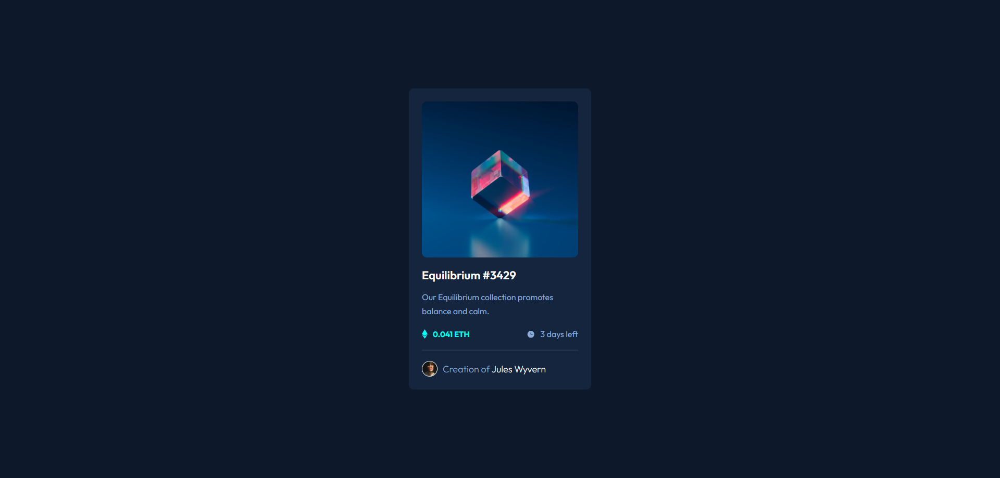

# Frontend Mentor - NFT Preview Card Component Solution

This is my solution to the [NFT preview card component challenge](https://www.frontendmentor.io/challenges/nft-preview-card-component-SbdUL_w0U) on Frontend Mentor.  
Frontend Mentor challenges help you improve your coding skills by building realistic projects.  

---

## 📸 Preview


---

## 📚 Table of contents

- [Overview](#overview)
  - [The challenge](#the-challenge)
  - [Screenshot](#screenshot)
  - [Links](#links)
- [My process](#my-process)
  - [Built with](#built-with)
  - [What I learned](#what-i-learned)
  - [Continued development](#continued-development)
- [Author](#author)

---

## 🌍 Overview

### The challenge
Users should be able to:

- View the optimal layout depending on their device's screen size  
- See hover states for interactive elements  

### Screenshot 



### Links

- Solution URL: [Frontend Mentor solution](https://www.frontendmentor.io/solutions/nft-preview-card-component-frontend-mentor-challenge-AumRJ7qLgh)
- Live Site URL: [visit](https://shimanto-codes.github.io/NFT-preview-card-component/)  

---

## ⚙️ My process

### Built with

- Semantic **HTML5** markup  
- **CSS3** custom properties  
- **Flexbox**  

### What I learned

- How to overlay elements on images with `position: absolute`  
- How to create hover effects using sibling selectors  
- How to work with **flexbox** to align items properly  

Example of hover effect logic:

```css
.img:hover .overlay {
  opacity: 0.5;
  cursor: pointer;
}

.img:hover .overlay + .view {
  display: block;
}
